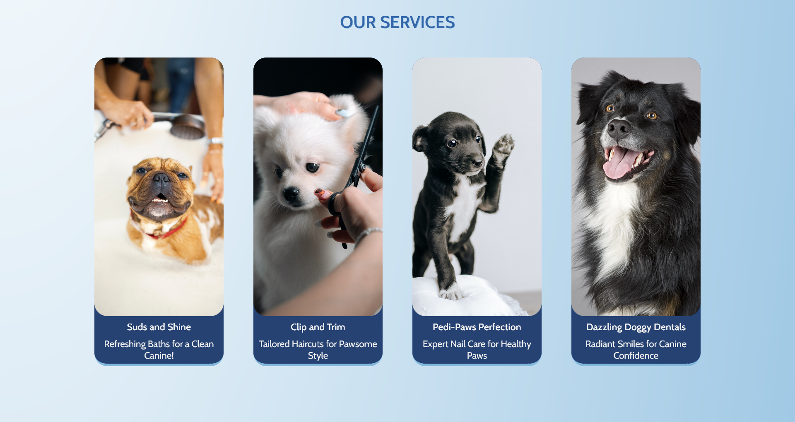
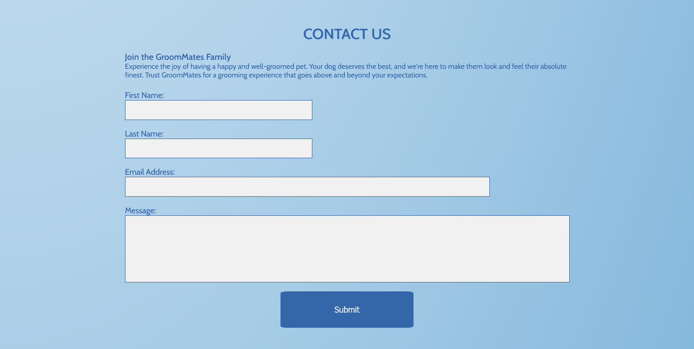

# GroomMates

GroomMates is a website for a dog grooming business based in Dublin, Ireland. 

The website is aimed at dog owners, and has information on how to book in their pet, the services provided and a gallery.

## Demo

A live demo of the project can be found here: 

https://chriscsms.github.io/groommates/

- - -

## Contents

* [User Experience](#user-experience-ux)
* [Design](#design)
* [Features](#features)
* [Technologies Used](#technologies-used)
* [Deployment and Local Development](#deployment-and-local-development)
* [Testing](#testing)
* [Credits](#credits)

- - -

# User Experience (UX)

## Initial Discussion

The dog grooming business GroomMates based in Dublin, is looking to give themselves a social media presence. 

### Key information

* What is GroomMates?
* Where is it based? 
* How to book an appointment?
* The services that are provided.

## User Stories

### Client Goals

* To make the site accessible across all devices. 
* To allow potential customers to make a booking.
* To show what types of services are provided. 
* To enable customers to learn more about the company.
* To show positive results with images and social media.

### First Time Visitor Goals

* I want to find out about GroomMates and how I can book.
* I want to easily navigate to find details about their services.
* I want to view their social media.

### Returning Visitor Goals

* I want to make another booking.
* I want to review the services that are provided. 

### Frequent Visitor Goals

* I want to check for any updated images in the gallery.

- - -

# Design

## Colour Scheme

The colour scheme uses a mix of blues and greys to create an approachable webpage. 

The color scheme chosen was found on Pinterest. 

## Typography

Google Fonts was used to import the fonts used for this project. 

Arvo and Cabin were used as they compliment each other well and add a friendly mood to the text.

## Imagery

Images used on the site were sourced from pexels and pixabay.

- - -

# Features

The website is composed of one page seperated into 5 different sections: Home, Services, Gallery, About and Contact. 

The website page has a header that contains the logo and a nav bar, the header follows the page as the user navigates through it. The page also contains a footer that has links to social media, the address and the copyright. 

### Home

The home section contains a hero image, a brief appealing description of the company to draw potential customers further into the site and a button which will redirect the user to the booking form. 

### Services 

The services section contains four boxes which highlight the services the company provides. Each box contains an image, a title and a description with it's own fun play on words.

### Gallery

The gallery is in a brick layout and shows images of dogs and dogs being groomed. 

### About 

The about section is split into an image and several paragraphs. These paragraphs hightlight key information on the company, the services and the practices they provide. 

### Contact

The contact section contains a form in which a potential customer can book for an appointment or contact the company for any queries. It contains fields for first name, last name, email address and message.

- - -

## Accessibility

To allow for the site to be more accessible:

* The code is written using semantic html.
* alt attributes are used on images  
* The colours are contrasted accordingly throughout the site. 

## Future Implementations

* Give each section it's own page.
* Ability to change the language of the page.
* A section for customer testimonies. 
* An addition to the form that allows customers to see available dates.

# Technologies Used

## Languages Used

HTML and CSS were used to create this website. 

## Frameworks, Libraries and Programs Used

* Git - For version control.
* Github - To save and store files for the website.
* Google Fonts - To import usable fonts to the website.
* Font Awesome - To import usable icons to the website.
* Google Dev Tools - For testing, troubleshooting and solving errors in code. 
* Am I Responsive? - To view the website on different devices as an image.

# Deployment and Local Development

## Deployment

The site is deployed using GitHub Pages - [GroomMates](https://chriscsms.github.io/groommates/)

1. Login or Signup to GitHub.
2. Go to the repository for the project, https://github.com/ChrisCSMS/groommates.
3. Find the settings button in the navigation bar and click.
4. In the left section, under "Code and automation", find the pages section and click. 
5. In the branch section, under "Build and deployment", click on the select branch dropdown and click main and the save. 
6. The site should now be deployed and might take a few minutes to be live.  

## Local Development

### How to Fork
- - -
To fork this repository:

1. Login or Signup to GitHub. 
2. Go to the repository for the project, https://github.com/ChrisCSMS/groommates.
3. Click the fork button in the top-right corner.

### How to Clone
- - -
To clone this repository:

1. Login or Signup to GitHub. 
2. Go to the repository for the project, https://github.com/ChrisCSMS/groommates.
3. Click on the code button, select which option to clone with, HTTPS, SSH or GitHub CLI and copy the link.
4. Open the terminal in your code editor and change the current working directory location to a new one for the copied directory.
5. Type git clone into the terminal followed by the link copied in step 3 and press enter.

# Testing 

Chrome Developer Tools was used to test the site during its development to recognize and source any issues and to resolve them.

## Automated Testing

The code was passed through the W3C validator for HTML and the W3C Validator for CSS without any errors.

Lighthouse within Chrome Developer Tools was also used to test performance on desktop and mobile.

#### Desktop

#### Mobile

## Manual Testing 

As a user: 

* Page loads and everything is visible. 
* Nav bar is readible and links connect to appropriate content.
* Button on header brings user to appropriate location.
* Navigation is shown to be highlighted by altering colours. 
* Nav bar and header follow user throughout the page effectively. 
* Images are clear and have an appropriate resolution.
* The form works as intended with users needing to input the correct information. 
* Social media links are clear, readible and link to the correct location.

- - -

# Credits
 
## Content

All content was written by myself. 

## Media 

The images used within the site are downloaded from Pexels and Pixabay.

## Acknowledgements

I would like to acknowledge the help I recieved in developing this project.

* Slack Community, for advice and recommendations.
* W3Schools for their helpful tutorials. 
* Code Institute Love Running project which prepared me for this project. 